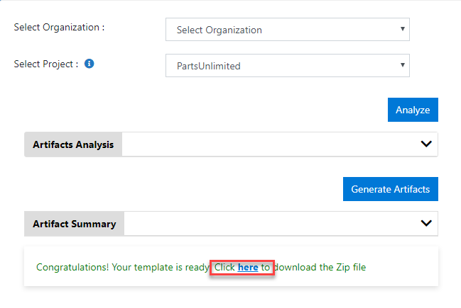
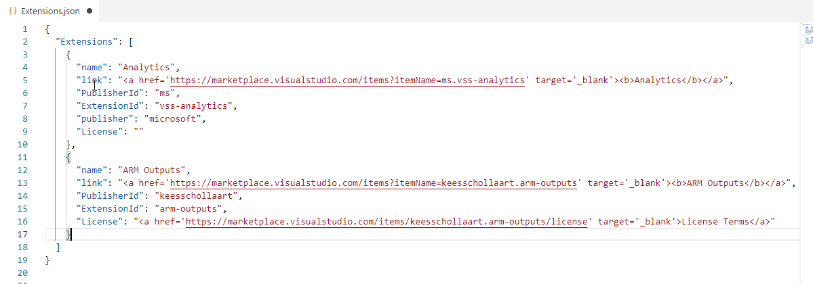
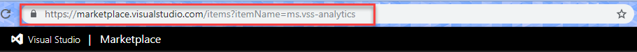

# Extension JSON Configuration

1. Download the Zip file from [Azure DevOps Demo Generator - Extractor page](https://vstsdemogenerator-test.azurewebsites.net/)

    

1. Unzip the Zip file,and open Extensions.json

    

1. Go to your Extension in  [Marketplace](https://marketplace.visualstudio.com)

1. Copy the URL 

    

1. Lets say, If the URL is 
    ```
    https://marketplace.visualstudio.com/items?itemName=ms.vss-analytics

    In the above URL _itemName_ query string,

    Till the first dot(.) is the publisher Id
    i.e, "PublisherId": "ms"

    and the rest is Extension Id
    i.e, "ExtensionId": "vss-analytics"

    ```

1. Copy the Extension Name and paste it in front of Key ``` Name ```

1. Copy the Extension URL and Paste it in front of key  ``` link ``` between the pair of ```<a href='EXTENSION_LINK_HERE' target='_blank'><b>EXTENSION_NAME_HERE</b></a>```

1. Copy the published Id and paste it in fornt of key ``` PublisherId ```

1. Copy the Extension Id and paste it in fornt of key ``` ExtensionId ```

1. If there are any ```License``` terms, copy the URL and paste it between the pair of ```<a href='LICENSE_LINK_HERE' target='_blank'><b>License Terms</b></a>```

1. Repeate the same if there are one or more Extension(s)
